# 💠 유휴 CPU를 이용한 블록체인 기부 활성화 서비스

> **“내 컴퓨터의 채굴이, 누군가의 생계가 된다.”**  
> 기술을 통한 자동화된 기부 시스템, 제3자 없이 기부자와 수혜자를 직접 연결하는 실험적 구조.

---

## 📌 프로젝트 개요

이 프로젝트는 **유휴 CPU를 활용한 블록체인 채굴**을 통해  
기부자가 수혜자에게 **직접 채굴 수익을 송금하는 시스템**을 구현하는 것을 목표로 합니다.

Node.js 기반 웹사이트는 수혜자의 채굴 프로그램 다운로드 링크만 제공하며,  
기부자는 해당 프로그램을 실행하는 것만으로도 **기부에 참여**하게 됩니다.

---

## 🎯 핵심 구조 및 아이디어

- 수혜자는 **본인의 지갑 주소를 설정한 채굴 프로그램을 등록**합니다. (교육을 통해 진행)
- 기부자는 웹사이트에서 해당 수혜자의 프로그램을 다운로드하고 **실행만 하면 됨**.
- 프로그램은 **수혜자의 지갑 주소를 기반으로 채굴을 수행**하며, 제3자의 개입 없이 **수익은 전부 수혜자에게 직접 전달**됩니다.
- 수혜자는 코인이 쌓이면 **기존 채굴 풀을 통해 직접 현금화**할 수 있으며, 이에 대한 안내도 제공됩니다.

---

## 🛠 사용 기술

| 항목 | 내용 |
|------|------|
| Language | Node.js, HTML, CSS |
| 구조 | Express.js 기반 간단한 서버 구조 |
| 채굴 프로그램 | XMRig, PhoenixMiner 등 외부 마이너 (지갑 주소만 바꿔서 사용) |
| 구성 | 수혜자 IP 및 지갑주소 기반 다운로드 제공 시스템 |

---

## ⚙️ 시스템 흐름

```mermaid
flowchart LR
    A[기부자] -->|웹사이트 접속| B[수혜자 목록 확인]
    B --> C[프로그램 다운로드]
    C --> D[실행]
    D --> E[채굴 시작]
    E --> F[수혜자 지갑으로 수익 송금]
```

### 🖥️ 웹사이트 예시 화면  

### ⛏️ XMRig 기반 채굴 구조  

### ⚙️ 프로그램 실행 전/후 비교  
- 실행 전  

- 실행 후  

